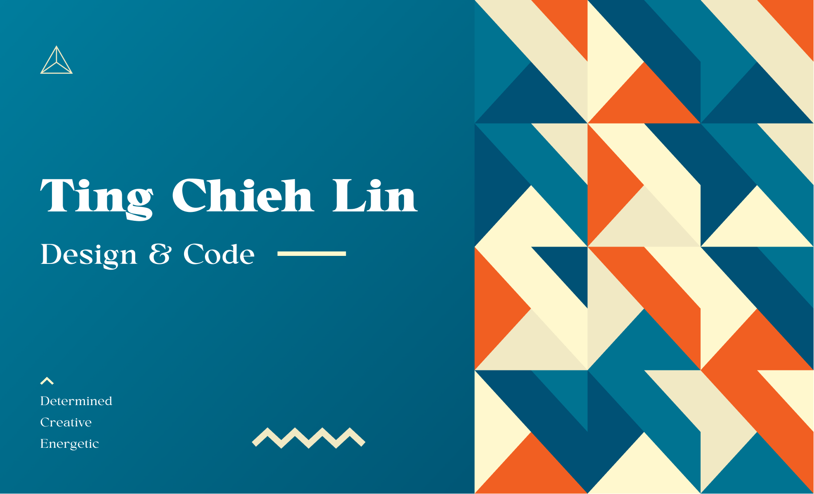

I am a UX/UI Designer and programmer to create pleasurable user experience & interface and interactions. Alos,I love exploring new tech stacks with creative methods and resolve problems.

## 💼 My Portfolio

To see more from my [Portfolio](https://tingchiehlin.com/)

## 📬 Contact Me

## 🧑🏼‍🏫 Mentoring Program

## 💰 You can support me by donating

## 📖 Table Of Contents

- [💼 My Portfolio](#-my-portfolio)
- [📬 Contact Me](#-contact-me)
- [🧑🏼‍🏫 Mentoring Program](#-mentoring-program)
- [💰 You can support me by donating](#-you-can-support-me-by-donating)
- [📖 Table Of Contents](#-table-of-contents)
  - [Front End Dev \& Design](#front-end-dev--design)
    - [Delightful + Animated](#delightful--animated)
    - [React Native \& Node.js](#react-native--nodejs)
  - [XR \& UX/UI \& Game](#xr--uxui--game)

### Front End Dev & Design

- [Top Movies](https://github.com/TingChiehLin/top-movies)
- [World Holidays](https://github.com/TingChiehLin/world-holidays)
- [SPLI TTER](https://github.com/TingChiehLin/spli-tter-ui)
- [Password Generate](https://github.com/TingChiehLin/password-generator)
- [Broccoli-Co-App](https://github.com/TingChiehLin/Broccoli-Co-App)
- [Drawing App](https://github.com/TingChiehLin/drawing-board)
- [Would you rather game](https://github.com/TingChiehLin/Would-You-Rather-Game)
- [Travel App](https://github.com/TingChiehLin/Travel-App)

#### Delightful + Animated

- [NFT-Card](https://github.com/TingChiehLin/nft-card)
- [GameMeet](https://gamemeet.vercel.app/)
- [Mosh Hero](https://github.com/TingChiehLin/mosh_hero)
- [Marvel-Hero](https://github.com/TingChiehLin/marvel-hero)

#### React Native & Node.js

- [Mobile-Flashcards](https://github.com/TingChiehLin/Mobile-Flashcards)
- [Image Processing API](https://github.com/TingChiehLin/image-processing-api)
- [Name Sorter](https://github.com/TingChiehLin/name-sorter)

### XR & UX/UI & Game

- [Animal Village](https://tingchiehlin.com/animalvillage)
- [Royal Botanic Gardens Victoria App](https://tingchiehlin.com/royalbotanicgarden)
- [Refresh DB](https://github.com/TingChiehLin/ux-challenge-refresh-db)
- [Melbourne Music Festival](https://tingchiehlin.com/musicfestival)
- [Coffee research & Design System](https://tingchiehlin.com/coffeeresearch)
- [Food waste reduction](https://tingchiehlin.com/foodwaste)
- [Starbucks Solutions](https://tingchiehlin.com/startbucks)
- [AR Pet](https://tingchiehlin.com/arpet)
