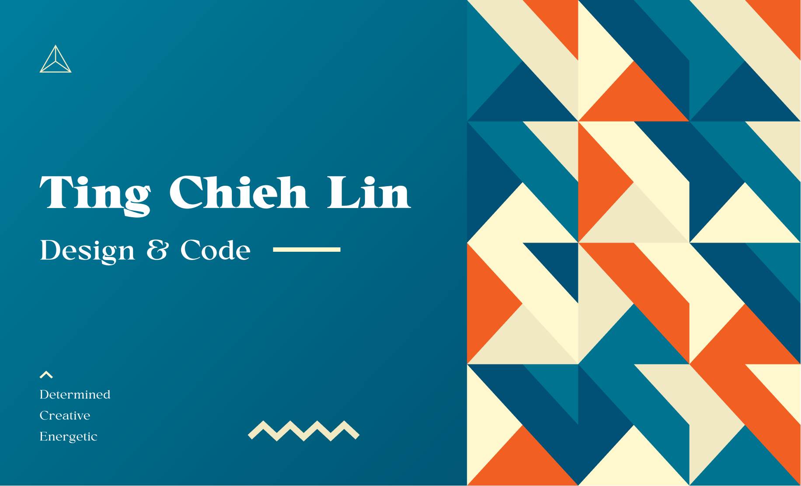

I’m a full-stack UX/UI developer and Master of Computer Science student, passionate about building meaningful digital experiences that blend design and technology. With a strong foundation in frontend development and user-centered design, I enjoy turning complex ideas into intuitive, visually engaging products. 

I’m especially interested in AI, human-computer interaction, and creative problem-solving. I also love collaborating, mentoring, and bringing people together through projects and events that bridge design and tech.

# 📖 Table Of Contents
- [📖 Table Of Contents](#-table-of-contents)
  - [💼 My Portfolio](#-my-portfolio)
  - [📬 Contact Me](#-contact-me)
  - [🧑🏼‍🏫 Mentoring Program](#-mentoring-program)
  - [💰 You can support me by donating](#-you-can-support-me-by-donating)
    - [AI \& Data \& Automation](#ai--data--automation)
    - [Full Stack Dev](#full-stack-dev)
    - [Front End Dev](#front-end-dev)
    - [React Native](#react-native)
    - [Others](#others)
    - [XR \& UX/UI \& Game](#xr--uxui--game)

## 💼 My Portfolio

To see more

- [Personal Website](https://tingchiehlin.com/)
- [Design Portfolio](https://www.behance.net/jaylinxr)
- [Devpost](https://devpost.com/cooloojayoo)
- [Curiosity Space](https://www.youtube.com/@Curiosity_Space-e3b)

## 📬 Contact Me

## 🧑🏼‍🏫 Mentoring Program

## 💰 You can support me by donating

### AI & Data & Automation

- [AgentsVille Trip Planner](https://github.com/TingChiehLin/agentsville_planner)
- [image_classifier_breed](https://github.com/TingChiehLin/image_classifier_breed)

### Full Stack Dev

- [Mood Music Recommender](https://github.com/TingChiehLin/ai-mood-music-recommender)
- [Product Feedback](https://github.com/TingChiehLin/product-feedback-app)

### Front End Dev

- [The News](https://github.com/TingChiehLin/the-news)
- [Top Movies](https://github.com/TingChiehLin/top-movies)
- [Crypto Search](https://github.com/TingChiehLin/crypto-search)
- [World Holidays](https://github.com/TingChiehLin/world-holidays)
- [Broccoli-Co-App](https://github.com/TingChiehLin/Broccoli-Co-App)
- [Mosh Hero](https://github.com/TingChiehLin/mosh_hero)
- [SPLI TTER](https://github.com/TingChiehLin/spli-tter-ui)

### React Native

- [MIXR](https://github.com/TingChiehLin/mixr)
- [Mobile-Flashcards](https://github.com/TingChiehLin/Mobile-Flashcards)

### Others

- [C-3PO](https://youtu.be/eKKtbI5PHLo?si=mSS_Glo_Qtpiwzwp)
- [Yummy CLI](https://github.com/TingChiehLin/CLI)
- [Image Processing API](https://github.com/TingChiehLin/image-processing-api)
- [Name Sorter](https://github.com/TingChiehLin/name-sorter)

### XR & UX/UI & Game

- [Animal Village](https://tingchiehlin.com/animalvillage)
- [Royal Botanic Gardens Victoria App](https://tingchiehlin.com/royalbotanicgarden)