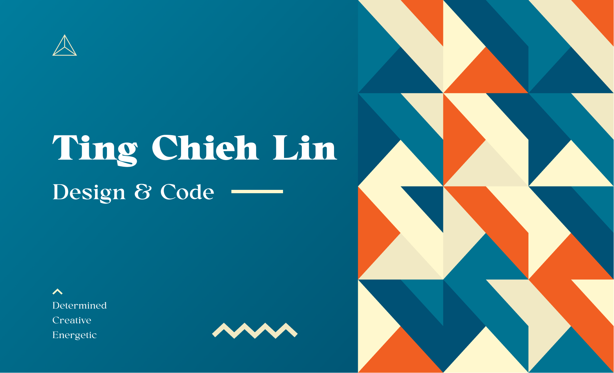

I am a Full Stack UI/UX Developer and Designer to create pleasurable user experience and interactions. I love exploring new tech stack with creative methods and discover different areas.

### 💼  My Portfolio

To see more from my [Portfolio](https://tingchiehlin.com/)

### 📬  Contact Me 

### Front End Dev

- React & Redux & React Native
   
    1. [MyReads-A-Book-Tracking-App](https://github.com/TingChiehLin/MyReads-A-Book-Tracking-App)
    2. [Would you rather game](https://github.com/TingChiehLin/Would-You-Rather-Game)
    3. [Mobile-Flashcards](https://github.com/TingChiehLin/Mobile-Flashcards)
        
- Others
     
    1. [Dinosaurs](https://github.com/TingChiehLin/Dinosaurs)
    2. [Travel App](https://github.com/TingChiehLin/Travel-App)
    3. [Mars Dashboard](https://github.com/TingChiehLin/Mars-Dashboard)
    4. [UdaciRacer Simulation Game](https://github.com/TingChiehLin/UdaciRacer-Sim)
    5. [Zendesk-Coding-Challenge](https://github.com/TingChiehLin/Zendesk-Ticket-Viewer)
    6. [GameMeet](https://gamemeet.vercel.app/)
    7. [Tic-Tac-Toe](https://github.com/TingChiehLin/Tic-Tac-Toe)
    8. [Personal-Blog-Website](https://github.com/TingChiehLin/Personal-Blog-Website)
    9. [Landing Page Project](https://github.com/TingChiehLin/Landing-Page)
    

